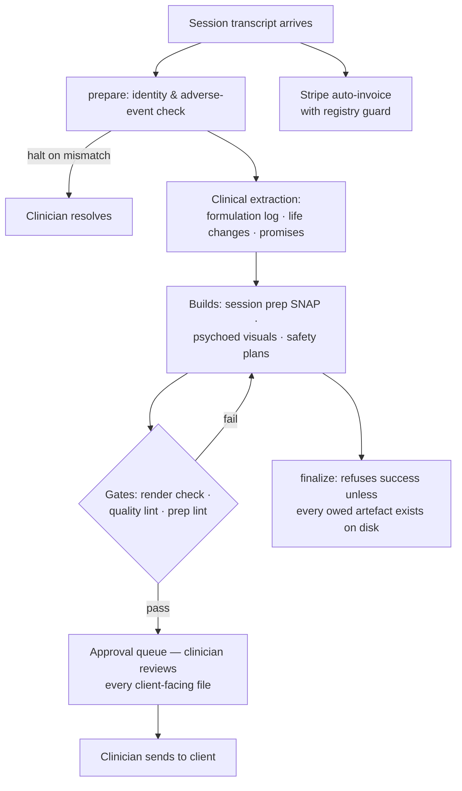

# An AI-Operated Clinical Practice — Designed by the Clinician

**Karyn Krawford** — Registered Clinical Psychotherapist & Social Scientist (PACFA), Sydney, Australia.

This repository documents a working system, not a demo. My solo psychotherapy practice runs on an
AI-orchestrated clinical operations layer that I designed and direct, built with Claude Code. It has
been in daily production use since early 2026, processing real session transcripts, preparing real
session prep, and running the practice's billing — with every client-facing output gated behind my
review.

**There is no client data in this repository and never will be.** Everything here is architecture,
design reasoning, and safety engineering. The working system lives entirely on a local machine;
client material never enters cloud sync folders, repositories, or logs.

---

## What the system does

Every therapy session produces a transcript. From that single input, the system:

1. **Verifies** the transcript belongs to the right client (an adverse-event and identity-mismatch
   check that can halt the whole pipeline).
2. **Extracts clinical signal** — formulation shifts, risk indicators, life changes, promises I made
   to the client ("I'll send you that worksheet") — and files each into the right living document.
3. **Builds the session prep** for the next session: a structured document (called a SNAP) with a
   safety box, an "open with" line, risk floors, transference tracking, and a pathway position —
   so I never walk into a session cold.
4. **Builds promised materials** — visual psychoeducation decks and handouts, personalised to the
   client's language, literacy, and clinical stage — and routes every one to an approval queue.
   Nothing reaches a client without my sign-off.
5. **Invoices the session** automatically through Stripe, with a registry-based guard against
   double-billing platform clients and a loud alert for any unrecognised billable session.
6. **Watches for dropout risk** — the system tracks session cadence per client and flags a
   two-week gap as an early dropout signal, because in therapy, silent disengagement is the
   failure mode that matters most.

Around that core pipeline sit scheduled agents (overnight transcript processing, a nightly
"tomorrow's prep" digest, retention watch, billing audit), a native Windows client-status panel
(PySide6/Qt), and a queue system that lets unattended runs defer questions only a human can answer —
what did the client's face do at minute 17? — into the next interactive session.

## Why this is interesting

Most AI-in-healthcare projects are either research prototypes or thin chat wrappers. This is a
different animal: a **safety-engineered production system operated by a domain expert who is not a
professional software developer**, where the AI does the building and the clinician does the
designing, constraining, and verifying.

The design centre is a rulebook (a long CLAUDE.md constitution) that encodes clinical judgment as
hard constraints. A few examples of what that looks like:

- **The filesystem is the only source of truth.** The AI is forbidden from claiming work is done
  from conversational memory; completion claims must be verified against files on disk. This rule
  exists because its absence once caused a real clinical near-miss — documented, diagnosed, and
  engineered against (see [SAFETY-ENGINEERING.md](SAFETY-ENGINEERING.md)).
- **Risk ratings have floors.** "No suicidal ideation stated in this transcript" is never allowed
  to collapse into "low risk." Forensic history, prior attempts, and early-stage clients carry
  standing minimum ratings that no single clean session can lower. A lint script audits for
  violations.
- **Nothing client-facing ships unrendered.** Every generated deck and handout must pass a
  render-to-image gate (a human-viewable proof it isn't overlapping, truncated, or broken) and a
  quality-and-accessibility lint (dyslexia-flagged clients get image-led, large-type materials —
  enforced by code, not intention).
- **AI voice is fenced off from the therapeutic relationship.** The system may draft structure and
  clinical substance, but relational warmth is the clinician's alone — generated "empathy" is
  treated as an alliance risk and stripped by rule.

## Architecture at a glance

Roughly 150 purpose-built scripts (Node.js, Python, PowerShell) around a document-based data layer:
every client has a living case file, a cumulative formulation log, a psychoeducation tracker, and
one live prep document — plain-text sources with auto-generated Word mirrors, because the clinician
reads Word, and the pipeline reads text. Full detail in [ARCHITECTURE.md](ARCHITECTURE.md).

## What I want to build next

The system proves a pattern: **a non-developer domain expert can design and operate serious,
safety-critical automation by encoding their professional judgment as constraints on an AI agent.**
The rulebook-plus-gates approach generalises well beyond one practice — to any solo professional
whose expertise is clinical, legal, or fiduciary rather than technical.

I'm interested in developing this into a repeatable model: how a practitioner's standards become
executable guardrails, how unattended AI runs stay inside them, and how the human approval loop
stays fast enough to be sustainable in a working week.

## Honest attribution

I did not hand-write this code. I designed the system, set every clinical rule, caught its failures,
and hardened it after each one; Claude Code wrote the implementation under that direction. I think
that division of labour — judgment from the human, code from the model, verification designed by
both — is exactly what makes this worth studying.

---

*Contact: via GitHub, or PACFA registry (Karyn Krawford).*
